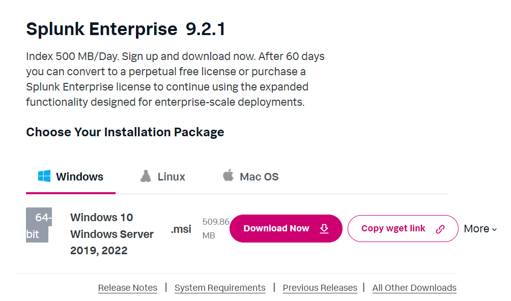
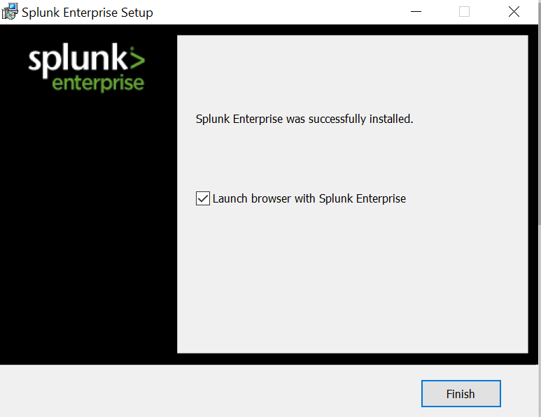
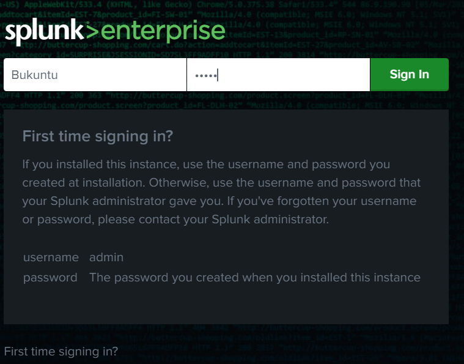
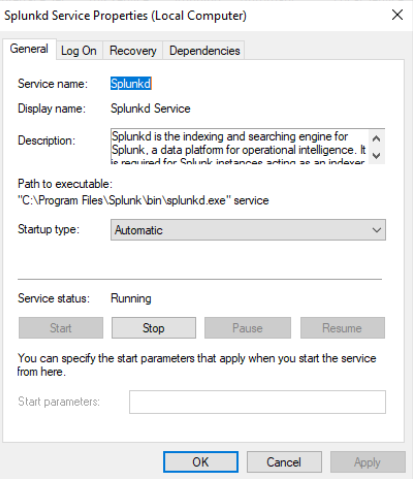
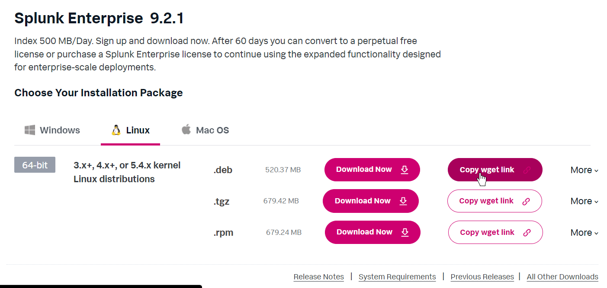
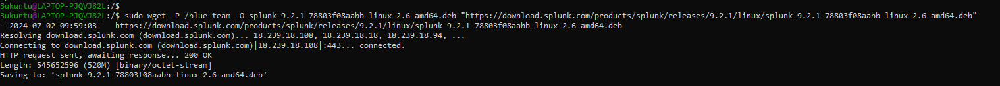
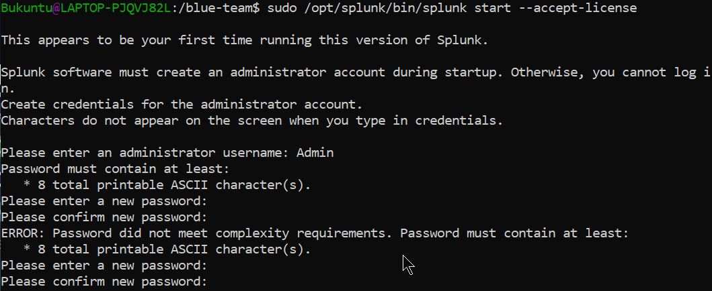
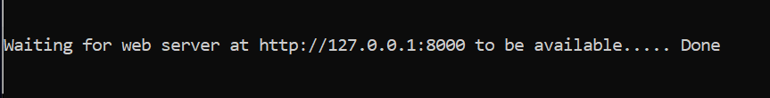
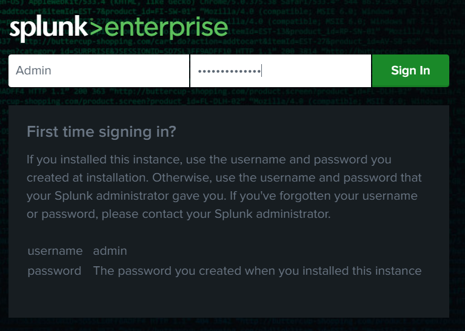

# Set up Splunk
## Install Splunk on Windows
- Go to Splunk website [here](https://www.splunk.com/en_us/download/splunk-enterprise.html)

- Create an account
- Download the Splunk Enterprise Installer


- Follow prompt and set username and password
- Follow the installation prompt and complete the process


- Sign in


- Check that Splunk is running. Search `Services` on windows search bar. Click `Splunkd`



## Install Splunk on Linux via CLI
- After creating account on the Splunk website
- Click on linux to get the download command. Ensure to choose the right extension (i.e `.deb` for Debian-based distros)


- Copy and paste the download link on your terminal prompt
```sh
sudo wget -P /blue-team -O splunk-9.2.1-78803f08aabb-linux-2.6-amd64.deb "https://download.splunk.com/products/splunk/releases/9.2.1/linux/splunk-9.2.1-78803f08aabb-linux-2.6-amd64.deb"                                           
```


- install Splunk
```sh
sudo dpkg -i <slunk>.deb
```

- Follow prompt. Supply new admin credentials


- Follow the link


- Start and login


## Manage Splunk on CLI
When you install Splunk on a Unix-based system, the application is typically installed in the /opt/splunk directory. 

The bin directory within this path contains executable files. Manage Splunk with the following command:

Start Splunk:
```sh
sudo /opt/splunk/bin/splunk start
```
Stop Splunk:
```sh
sudo /opt/splunk/bin/splunk stop
```
Restart Splunk:
```sh
sudo /opt/splunk/bin/splunk restart
```
Status Splunk:
```sh
sudo /opt/splunk/bin/splunk status
```
Access various configuration and management commands:
```sh
sudo /opt/splunk/bin/splunk <command>
```


